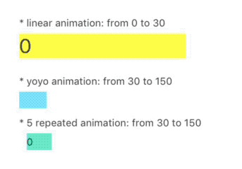

# ValueAnimator

[](https://travis-ci.org/brownsoo/ValueAnimator)
[](http://cocoapods.org/pods/ValueAnimator)
[](http://cocoapods.org/pods/ValueAnimator)
[](http://cocoapods.org/pods/ValueAnimator)
[](https://codebeat.co/projects/github-com-brownsoo-valueanimator-master)

- [ ] To add more example
- [ ] Add easy methods for UIView property animation

## Demo



## Usage

ValueAnimator makes the transition from initial value to target value using easing functions.

#### Simple animation

```
let animator = ValueAnimator.animate("some", from: 0, to: 360, duration: 1.0,
    onChanged: { p, v in 
        print("property \(p): \(v.value)")
    },
    easing: EaseCircular.easeIn())
animator.resume()
```

#### Thread

ValueAnimator uses its own work-thread. But the callback 'ChangeFunction', 'EndFunction' is called in main-thread. if you wanna it called in work-thread, you just set the 'callbackOnMainThread' property is false.

```
let someView: UIView!
let animator = ValueAnimator.animate("some", from: 0, to: 1, duration: 1.0,
    onChanged: { p, v in 
        // called in ValueAnimator's work-thread
    },
    easing: EaseCircular.easeIn())
animator.callbackOnMainThread = false
animator.resume()
```

## Example

To run the example project, clone the repo, and run `open ValueAnimator.xcworkspace`. 
You can see ValueAnimatorExample project.

## Installation

ValueAnimator is available through [CocoaPods](http://cocoapods.org). To install
it, simply add the following line to your Podfile:

```ruby
pod 'ValueAnimator'
```

## Author

brownsoo, [@hansoo.labs](https://twitter.com/hansoolabs)

## License

ValueAnimator is available under the MIT license. See the LICENSE file for more info.
